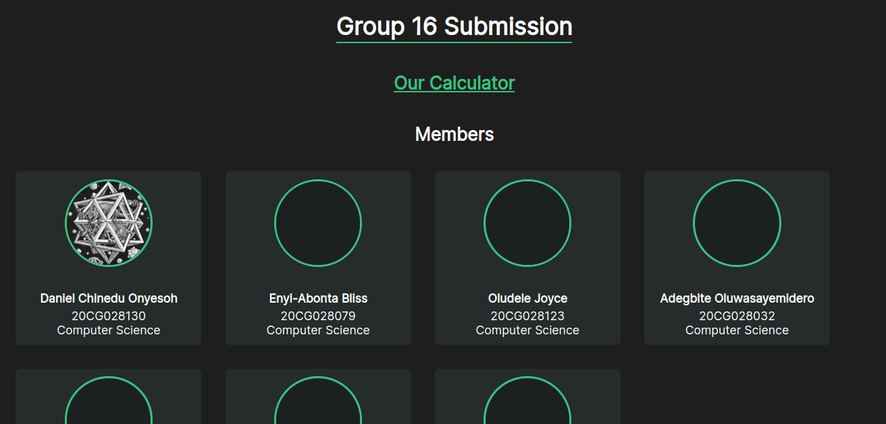
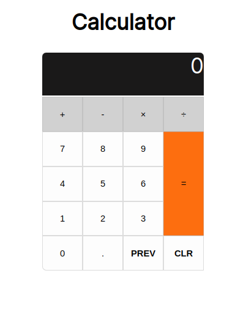

# CSC 310 Practical Assignment (Group 16)

We were assigned to build a HTML, CSS and Vanilla JS site that has:

- The biodata of the group members
- Has a calculator able to handle basic arithmetic.

- Have a form that reflects the content of the biodata presented.

## Group Members

- 20CG028130 Onyesoh Daniel Chinedu
- 20CG028032 Adegbite Oluwasayemidero Oluwafikayomi
- 20CG028063 Daudu John Ayanfeoluwa
- 20CG028079 Enyi-Abonta Bliss Nnema
- 20CG028123 Oludele Joyce Tewogbola
- 20CH028162 Ebunlomo Daniel
- 20CH028189 Soji-Odus Korede

## Deliverables

1. The link to the site
2. The web files in a zipped folder
3. A printed copy of all the files with codes (Each section of the code should be well
explained with comments).
